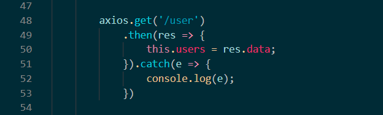

# 100deCilantroFront

# Tecnologias

Vue es un framework open source de JavaScript, el cual nos permite construir interfaces de usuarios de una forma muy sencilla. Se trabaja por medio de componentes. Un componente Vue, en términos simples, es un elemento el cual se encapsula código reutilizable, dentro de un componente podremos encontrar etiquetas HTML, estilos de CSS y código JavaScript.
https://vuejs.org/

## Requisitos
- Node.js
- Vue.cli
- Vuetify
- Axios
```
$ npm install -g @vue/cli
$ vue add vuetify
$ npm install axios
```

## Project setup
```
npm install
```

### Compiles and minifies for production
```
npm run build
```

### Lints and fixes files
```
npm run lint
```

## Peticiones Front-end


Es un cliente HTTP basado en Promesas para Javascript, el cual puede ser utilizado en el Front-end, como en el Back-end por medio de Nodejs. Utilizando Axios, es muy sencillo enviar peticiones a endpoints REST y realizar operaciones CRUD. 
- Petición Post
    - axios.post(url, params)
- Peticion Get
    - axios.get(url, params)



Axios en cada petición nos devuelve una promesa, la cual debemos manipular haciendo uso de los métodos .then/.catch para capturar la respuesta y los errores respectivamente.

### Repositorio Docker
https://github.com/SebasAyala/100deCilantroDocker

### Repositorio Backend
https://github.com/duvanmanzano/100deCilantro


### Customize configuration
See [Configuration Reference](https://cli.vuejs.org/config/).

